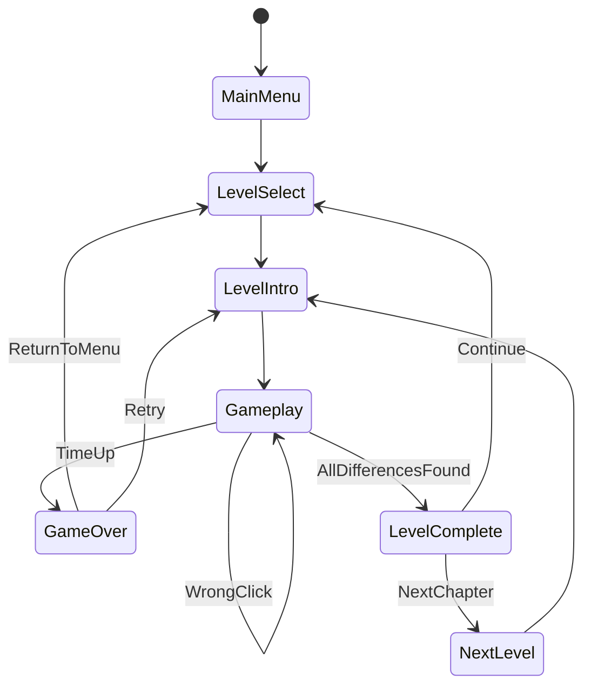

# Design Document: Horror Memory - Trova le Differenze Horror

## Concept Generale

Un gioco "trova le differenze" che evolve in un'esperienza horror psicologica progressiva. Ogni differenza trovata non solo rivela l'oggetto nell'immagine vuota, ma **trasforma** l'immagine originale in qualcosa di sempre più inquietante, mentre l'atmosfera degrada progressivamente.

---

## 1. Core Mechanics

### 1.1 Meccanica Base del Click

- **Click Corretto**: 
        - Rivela l'oggetto nell'immagine di confronto (quella "vuota")
        - Nell'immagine originale, l'oggetto si trasforma in versione horror
        - Trigger di escalation atmosferica (audio, filtri visivi, particelle)
        - Possibile jumpscare sottile (ombra che passa, suono distante)

- **Click Sbagliato**:
        - Penalità di -5 secondi di default (configurabile per livello)
        - Effetto visivo di disturbo (glitch, static)
        - Suono inquietante
        - Accumulo di "tensione" che può triggare eventi horror

### 1.2 Sistema di Trasformazione Progressiva

Ogni differenza trovata incrementa il "Horror Level" del livello:

```
Differenza 1/7: Oggetto normale → Macchia scura
Differenza 2/7: Secondo oggetto → Ombra umanoide
Differenza 3/7: Terzo oggetto → Dettaglio disturbante (occhi, sangue)
Differenza 4/7: Quarto oggetto → Trasformazione maggiore
...
Differenza 7/7: Ultima → Rivelazione completa dell'horror
```

### 1.3 Sistema di Aiuti (3 disponibili)

- **Tipo 1 - Area Hint**: Evidenzia una zona generale dove c'è una differenza
- **Tipo 2 - Pulse Hint**: Fa pulsare brevemente tutte le differenze rimanenti
- **Tipo 3 - Reveal One**: Rivela automaticamente una differenza (ma senza punti bonus)

### 1.4 Timer e Pressione

- Timer visibile che aumenta la tensione
- Sotto i 30 secondi: effetti visivi di urgenza (vignetta rossa, heartbeat audio)
- Se il tempo scade: sequenza di "sconfitta" con il mostro del livello

---

## 2. Struttura dei Livelli (Narrativa Continua)

### 2.1 Arco Narrativo

**Storia**: Il giocatore esplora i ricordi/fotografie di una casa maledetta. Ogni livello è un "capitolo" che rivela progressivamente la tragedia che è avvenuta.

**Capitoli proposti** (esempio per 10-15 livelli):

1. **L'Arrivo** - Foto della casa dall'esterno, giorno soleggiato
2. **Il Soggiorno** - Interno accogliente che diventa inquietante
3. **La Cucina** - Dettagli domestici che rivelano anomalie
4. **Le Scale** - Transizione verso il piano superiore
5. **La Camera dei Bambini** - Horror psicologico infantile
6. **La Camera da Letto** - Scoperta dei proprietari
7. **Il Bagno** - Elementi disturbanti (sangue, specchi)
8. **La Soffitta** - Oggetti del passato, rivelazioni
9. **Il Seminterrato** - Escalation massima
10. **La Verità** - Livello finale rivelatorio

### 2.2 Progressione Difficoltà

```
Livelli 1-3:   7 differenze, 180s, penalty -5s  [Introduzione]
Livelli 4-6:   8 differenze, 150s, penalty -7s  [Crescita tensione]
Livelli 7-9:   9 differenze, 120s, penalty -10s [Alta tensione]
Livelli 10+:   10+ differenze, 90s, penalty -15s [Estremo]
```

### 2.3 Struttura Intro/Outro di Ogni Livello

- **Intro (10-20s)**: Schermata nera con testo narrativo + musica ambientale
- **Gameplay**: Trova le differenze con trasformazioni progressive
- **Outro Vittoria**: Testo conclusivo del capitolo + transizione
- **Outro Sconfitta**: Jumpscare del mostro del livello + game over

---

## 3. Sistema Atmosferico (Horror Escalation)

### 3.1 Audio Layering Progressivo

**Struttura a 5 Layer** (ogni differenza trovata aggiunge/modifica layer):

```
Layer 0 (Inizio):     Musica ambientale calma, suoni naturali
Layer 1-2:            Aggiunge sottofondo sinistro, note discordanti
Layer 3-4:            Introduce sussurri, respiri, creaking
Layer 5-6:            Heartbeat, static noise, voci distorte  
Layer 7 (Completo):   Climax musicale horror
```

**Audio Assets necessari per livello**:

- 1x Traccia ambientale base (loop)
- 1x Traccia horror overlay (loop, fade-in progressivo)
- 3-5x Suoni di transizione (per ogni differenza trovata)
- 1x Suono completamento livello
- 1x Suono game over/jumpscare

### 3.2 Post-Processing Visivo Progressivo

Usando Unity URP Post-Processing (già configurato nel progetto):

```csharp
Differenza 0:   Normal (nessun effetto)
Differenza 1-2: Leggero color grading (desaturazione 10%)
Differenza 3-4: Vignette (intensità 0.3), Chromatic Aberration (0.2)
Differenza 5-6: Grain/Film (0.4), più desaturazione (30%)
Differenza 7:   Tutti gli effetti al massimo + possibile distorsione
```

### 3.3 Particelle e Effetti Ambientali

- **Polvere/nebbia**: Aumenta l'opacità progressivamente
- **Ombre dinamiche**: Ombre che si muovono ai bordi dello schermo
- **Glitch effects**: Distorsioni temporanee dell'immagine
- **Sangue/macchie**: Appaiono progressivamente sui bordi

---

## 4. UI/UX Design

### 4.1 Layout Gameplay

```
┌─────────────────────────────────────────────────────┐
│  [Timer: 02:35]    [❤️❤️❤️ Lives]    [Differenze: 3/7] │
├─────────────────────────────────────────────────────┤
│                                                       │
│  ┌──────────────┐         ┌──────────────┐         │
│  │              │         │              │         │
│  │   Immagine   │         │   Immagine   │         │
│  │   Originale  │         │  Confronto   │         │
│  │  (Transform) │         │   (Reveal)   │         │
│  │              │         │              │         │
│  └──────────────┘         └──────────────┘         │
│                                                       │
├─────────────────────────────────────────────────────┤
│  [💡Hint 1] [💡Hint 2] [💡Hint 3]     [⏸️ Pause]     │
└─────────────────────────────────────────────────────┘
```

### 4.2 Schermate Principali

1. **Main Menu**: Minimalista, atmosfera dark, font horror-themed
2. **Level Select**: Mappa dei capitoli con preview e lock/unlock
3. **Gameplay**: Layout sopra
4. **Pause Menu**: Continua/Restart/Menu/Settings
5. **Game Over**: Immagine mostro + testo sconfitta + retry
6. **Level Complete**: Stats (tempo, stelle, differenze), next chapter button

### 4.3 Feedback Visivo

- **Differenza trovata (corretta)**:
        - Cerchio verde che pulsa sulla posizione
        - Particle burst positivo
        - Suono di conferma
        - Fade-in della trasformazione horror (1-2s)

- **Click sbagliato**:
        - X rossa temporanea
        - Screen shake leggero
        - Suono di errore inquietante
        - Penalità tempo visibile (-5s animato)

---

## 5. Sistema Mostri e Game Over

### 5.1 Mostri per Capitolo

Ogni livello ha il suo "mostro guardiano" che appare in caso di sconfitta:

```
Livello 1-2:   Ombra umanoide generica
Livello 3-4:   Figura con occhi luminosi
Livello 5-6:   Entità distorta/bambino spettrale
Livello 7-8:   Creatura body-horror
Livello 9-10:  Il "vero" antagonista rivelato
```

### 5.2 Sequenza Game Over

1. Timer raggiunge 0:00
2. Fade to black (0.5s)
3. Suono di respiro/heartbeat accelerato
4. Jump-scare: Mostro appare con effetto sonoro (0.3s)
5. Testo "YOU FAILED" + messaggio narrativo
6. Opzioni: Retry / Main Menu

**Nota**: Il jumpscare deve essere efficace ma non eccessivo (PEGI/age rating consideration per Steam)

---

## 6. Sistema Progressione e Rigiocabilità

### 6.1 Sistema a Stelle

Basato sul tempo di completamento (già implementato in [`Assets/Scripts/ScriptableObjects/LevelData.cs`](Assets/Scripts/ScriptableObjects/LevelData.cs)):

```
⭐⭐⭐: Completato in < 50-70% del tempo limite (basato su difficoltà)
⭐⭐:   Completato in < 75-85% del tempo limite
⭐:     Completato entro il tempo limite
```

### 6.2 Unlock Progressivo

- Livelli sbloccati linearmente (completare N per sbloccare N+1)
- Possibile "fast-forward" dopo aver completato il gioco una volta
- Collectibles opzionali: trovare tutte le differenze sotto tempo bonus per lore extra

### 6.3 Achievements Steam

Esempi:

- "First Blood" - Completa il primo livello
- "Survivor" - Completa 5 livelli senza game over
- "Perfectionist" - Ottieni 3 stelle in tutti i livelli
- "Speedrunner" - Completa un livello in metà del tempo
- "Blind Eye" - Completa un livello senza usare hint
- "The Truth" - Completa la storia completa
- "Nightmare Mode" - Completa tutti i livelli in Hard

---

## 7. Architettura Tecnica (Unity)

### 7.1 Manager System

Basato sui file esistenti, implementare questi Manager:

**GameManager.cs** (Singleton)

- Gestisce GameState (enum già definito)
- Salvataggio/caricamento progresso
- Transizioni tra scene

**LevelManager.cs**

- Carica LevelData da ScriptableObject
- Inizializza UI e immagini
- Traccia differenze trovate
- Gestisce timer e penalty

**AudioManager.cs**

- Sistema audio layering progressivo
- Fade in/out tra tracce
- Gestione SFX e jumpscare sounds
- Volume mixing dinamico

**UIManager.cs**

- Aggiorna timer, counter differenze, hints
- Animazioni UI
- Gestisce popup e transizioni
- Feedback visivo click

**AtmosphereManager.cs**

- Controlla post-processing volume
- Gestisce particelle ambientali
- Escalation effetti visivi
- Sincronizza con progresso differenze

**InputManager.cs**

- Gestisce click su immagini
- Calcola posizione normalizzata
- Verifica collisione con DifferenceInfo
- Gestisce hint activation

### 7.2 Flusso di Gioco (Diagramma)



### 7.3 Sistema di Trasformazione Sprite

**TransformationSystem.cs**

```csharp
// Gestisce il fade tra sprite normale e sprite horror
// Per ogni DifferenceInfo, memorizza:
- Sprite original (stato iniziale)
- Sprite horror (stato trasformato)
- Animation curve per fade
- Durata transizione (1-2s)
```

**DifferenceInfo Enhancement**

Estendere la classe esistente [`Assets/Scripts/Classes/DifferenceInfo.cs`](Assets/Scripts/Classes/DifferenceInfo.cs):

```csharp
public class DifferenceInfo
{
    // Esistente
    public Vector2 normalizedPosition;
    public float deflectionRadius = 50f;
    public Sprite highlightSprite;
    public Color highlightColor;
    
    // Nuovo per horror transformation
    public Sprite horrorTransformSprite;      // Sprite horror da mostrare
    public GameObject horrorVFXPrefab;        // Particelle per transizione
    public AudioClip transformationSound;     // Suono specifico
    public float transformDuration = 1.5f;    // Durata fade
    public int horrorIntensityBoost = 1;      // Quanto aumenta l'atmosfera
}
```

---

## 8. Asset Guidelines & Placeholder Strategy

### 8.1 Requisiti Immagini

**Risoluzione Target**: 1920x1080 (Full HD)

**Struttura per ogni livello**:

1. **Base Image**: Immagine "normale" dello scenario
2. **Horror Overlay Layers** (7+ layer, uno per differenza):

            - Layer per ogni trasformazione horror
            - Usare layer mask in Photoshop/GIMP
            - Export come PNG con alpha channel

**Workflow consigliato**:

```
1. Crea immagine base (es: stanza normale)
2. Duplica layer e crea 7 varianti progressive:
   - Variante 1: Aggiungi macchia scura in area X
   - Variante 2: Aggiungi ombra inquietante in area Y
   - ...
   - Variante 7: Immagine completamente trasformata
3. Export ogni stato come sprite separato
4. In Unity, crea animation che sfuma tra stati
```

**Placeholder temporanei**:

- Usare immagini stock free (Unsplash, Pexels) di interni domestici
- Modificare in GIMP/Photoshop con filtri horror
- Utilizzare asset gratuiti da Unity Asset Store (filtri, overlays)

### 8.2 Requisiti Audio

**Per ogni livello servono**:

- 1x Ambient Base (60-90s loop, calmo)
- 1x Horror Overlay (60-90s loop, intenso)
- 1x Click Corretto (0.5s, positivo ma inquietante)
- 1x Click Sbagliato (0.5s, negativo, disturbante)
- 1x Transformation SFX (1-2s, per ogni differenza)
- 1x Jumpscare Sound (1-2s, per game over)
- 1x Level Complete (2-3s, risoluzione tensione)

**Placeholder/Free Resources**:

- Freesound.org (CC0 sounds)
- Incompetech.com (Kevin MacLeod, royalty-free)
- Unity Asset Store (Horror Sound Pack - vari free)
- Soundstripe/Epidemic Sound (licenze commerciali per release Steam)

**Linee guida Horror Psicologico**:

- Preferire suoni ambientali sottili vs jump-scare loud
- Usare frequenze basse (sotto 100Hz) per disagio subconscio
- Evitare musica melodica, preferire droni e texture
- Layer di sussurri quasi impercettibili

### 8.3 Font e UI Assets

**Font consigliati** (free for commercial):

- **Creepster** (Google Fonts) - per titoli horror
- **Nosifer** (Google Fonts) - alternative horror title
- **Roboto** (Google Fonts) - per testo leggibile UI

**UI Elements**:

- Icone: FontAwesome (free) o Material Icons
- Pulsanti: Creare in Unity UI con gradient dark/blood red
- Timer: Font monospace con glow rosso
- Hints: Icone lampadina custom o da icon pack

---

## 9. Ottimizzazione e Performance

### 9.1 Target Platforms (Steam)

- **Primary**: Windows 10/11 (64-bit)
- **Secondary**: macOS, Linux (considera Unity portability)

**System Requirements proposti**:

```
MINIMUM:
- OS: Windows 10
- CPU: Intel Core i3 / AMD equivalent
- RAM: 4 GB
- GPU: Integrated graphics
- Storage: 2 GB

RECOMMENDED:
- OS: Windows 11
- CPU: Intel Core i5 / AMD Ryzen 5
- RAM: 8 GB
- GPU: GTX 1050 / AMD RX 560
- Storage: 2 GB SSD
```

### 9.2 Ottimizzazioni Unity

- Usare **Sprite Atlas** per UI elements
- **Texture Compression** per immagini livelli (DXT/BC7)
- **Audio Compression**: Ogg Vorbis per musica, WAV per SFX corti
- **Object Pooling** per particle systems e UI feedback
- **Additive Scene Loading** per menu + gameplay
- **URP Optimizations**: Mobile renderer per GPU integrata

### 9.3 Loading Strategy

```
Main Menu Scene (sempre caricata)
  └─> Additive Load: Level Scene
       └─> Async Load: Level Assets (immagini, audio)
            └─> Fade-in quando pronto (no freezing)
```

---

## 10. Steam Integration & Publishing

### 10.1 Steam Features da Implementare

**Steamworks SDK Integration**:

- **Achievements**: 15-20 achievements (vedi sezione 6.3)
- **Cloud Saves**: Salvare progresso automaticamente
- **Leaderboards**: Tempo migliore per ogni livello
- **Stats**: Tracciare statistiche (differenze trovate, tempo totale, ecc.)
- **Trading Cards**: Opzionale, 5 carte collezionabili
- **Workshop**: Possibile supporto per livelli custom (post-launch)

### 10.2 Store Page Elements

**Capsule Image** (616x353px):

- Titolo "Horror Memory" con font horror
- Tagline: "Find the differences... before they find you"
- Visual: Split immagine normale/horror

**Screenshots** (almeno 5):

1. Main menu atmospheric
2. Gameplay early level (normale)
3. Gameplay mid-level (trasformazione in atto)
4. Gameplay late-level (completamente horror)
5. Monster jumpscare (teaser)

**Trailer** (60-90s):

- 0-15s: Hook (jumpscare leggero)
- 15-45s: Gameplay loop e meccaniche
- 45-60s: Progressione atmosfera
- 60-90s: Montaggio finale + release date

**Tags suggeriti**:

Horror, Puzzle, Atmospheric, Psychological Horror, Singleplayer, Story Rich, Dark, Indie, Point & Click, Mystery

### 10.3 Pricing Strategy (Premium Model)

**Analisi mercato**:

- Giochi simili: Find Yourself ($5-10), Differences ($3-5)
- Horror puzzle indie: $10-15

**Proposta**: **$9.99** (€9.99)

- Include 10-15 livelli completi
- Storia completa
- Tutti gli achievements
- Cloud saves

**Post-Launch Content** (free updates):

- Aggiunta livelli bonus
- Modalità "Nightmare" (più difficile)
- Possibile supporto Workshop

---

## 11. Development Roadmap

### Fase 1: Core Prototype (2-3 settimane)

- [ ] Implementare Manager base (Game, Level, UI, Input)
- [ ] Sistema click e rilevamento differenze
- [ ] Timer e penalità
- [ ] 1 livello placeholder completo
- [ ] UI base funzionante

### Fase 2: Horror Systems (2-3 settimane)

- [ ] Sistema trasformazione sprite
- [ ] Audio Manager con layering
- [ ] Post-processing escalation
- [ ] Particle systems ambientali
- [ ] Monster jumpscare system

### Fase 3: Content Creation (4-6 settimane)

- [ ] Creazione 10-15 immagini livelli
- [ ] Scrittura narrativa completa
- [ ] Asset audio (musica + SFX)
- [ ] UI art finale
- [ ] Animazioni e polish

### Fase 4: Integration & Polish (2-3 settimane)

- [ ] Sistema salvataggio/progressione
- [ ] Level select e menu flow
- [ ] Achievements implementation
- [ ] Bug fixing e optimization
- [ ] Playtest e balancing

### Fase 5: Steam Preparation (1-2 settimane)

- [ ] Steamworks SDK integration
- [ ] Store page assets (capsule, screenshots)
- [ ] Trailer creation
- [ ] Beta testing su Steam
- [ ] Marketing materials

### Fase 6: Launch & Support (ongoing)

- [ ] Launch day monitoring
- [ ] Hotfix per bug critici
- [ ] Community feedback
- [ ] Post-launch content planning

**Tempo totale stimato**: 3-4 mesi per sviluppo completo

---

## 12. Consigli Finali & Best Practices

### 12.1 Design Horror Psicologico

✅ **Da Fare**:

- Costruire tensione gradualmente, non tutto subito
- Usare il "Less is More" approach (suggerire piuttosto che mostrare)
- Suono è 50% dell'horror - investi in audio quality
- Dare al giocatore momenti di "respiro" tra le tensioni
- Usare jumpscares con parsimonia e quando hanno senso narrativo

❌ **Da Evitare**:

- Jumpscares random continui (perdono efficacia)
- Gore eccessivo senza contesto
- Horror troppo esplicito (limita audience)
- Frustrazione eccessiva (balance difficoltà)

### 12.2 Game Feel & Polish

- **Juice everything**: Ogni interazione deve avere feedback
- **Screen shake** moderato per eventi importanti
- **Particle bursts** per feedback positivo
- **Sound layering**: mai un evento senza audio
- **Anticipation**: anima le trasformazioni gradualmente

### 12.3 Testing & Feedback

- **Playtesting early**: Testa con persone non-sviluppatori
- **Difficulty curve**: I primi 2-3 livelli devono essere facili
- **Horror tolerance**: Non tutti sopportano lo stesso livello di spavento
- **Accessibility**: Considera opzioni per ridurre jumpscares

### 12.4 Marketing & Community

- **Build hype early**: Post devlog su Reddit (r/gamedev, r/horror)
- **GIF marketing**: Clip brevi delle trasformazioni su Twitter
- **Wishlist campaign**: Steam wishlist sono fondamentali per algoritmo
- **Press kit**: Preparare EPK per reviewer
- **Influencer outreach**: Horror gaming YouTubers/Streamers

### 12.5 Post-Launch

- **Monitor feedback**: Steam reviews e discussion board
- **Patch rapidamente**: Bug critici devono essere fixati entro 48h
- **Engage community**: Rispondi a domande e feedback
- **Plan DLC/Updates**: Se il gioco va bene, espandi con nuovi capitoli

---

## Conclusione

Hai un concept molto forte! La combinazione di trova-differenze + horror psicologico + trasformazioni progressive è originale e può creare un'esperienza memorabile.

**Punti di forza del tuo design**:

- ✅ Meccanica familiare (spot differences) con twist unico
- ✅ Escalation atmosferica naturale e motivata dal gameplay
- ✅ Narrativa integrata nelle meccaniche
- ✅ Rigiocabilità (stelle, leaderboard, achievements)
- ✅ Scope gestibile per indie team

**Key Success Factors**:

1. **Audio Design**: Investi tempo qui, fa la differenza tra ok e ottimo
2. **First 30 seconds**: Il hook iniziale è cruciale
3. **Difficulty Balance**: Playtesting con audience varia
4. **Atmosphere Consistency**: Mantieni il tone horror psicologico

Buona fortuna con lo sviluppo! 🎮👻